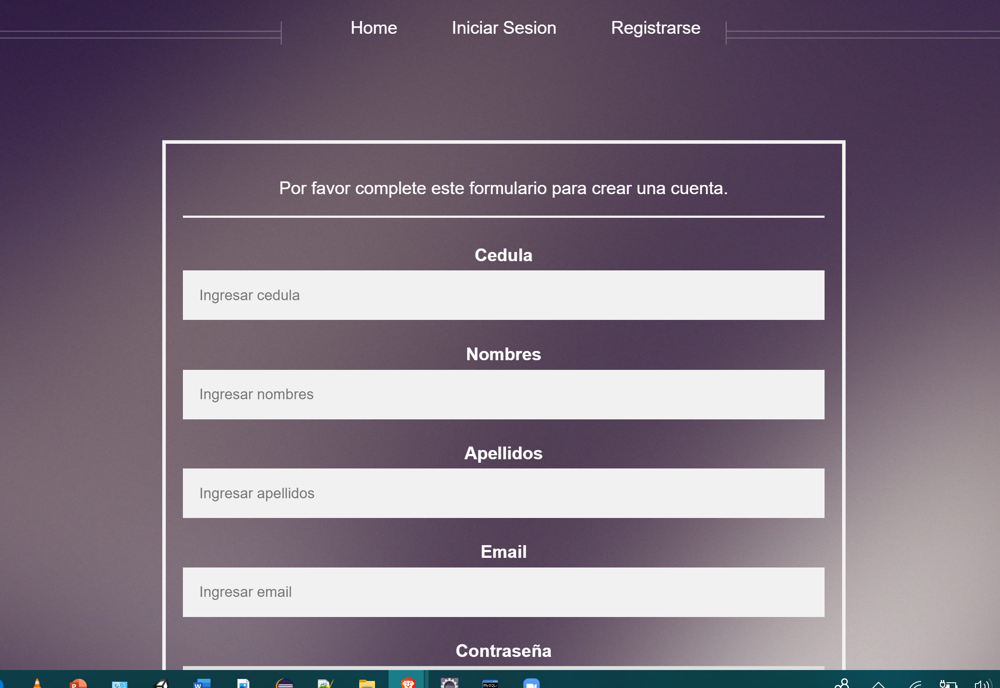

| **Crear un repositorio en GitHub con el nombre “Práctica de laboratorio 01: Servlets, JSP y JDBC”** |
|-----------------------------------------------------------------------------------------------------|

| **Desarrollar una aplicación con tecnología JEE para gestionar una agenda telefónica en la web.** |   |
|---------------------------------------------------------------------------------------------------|---|

-   **Implementar una agenda telefónica en donde se tendrán usuarios con datos
    como cedula, nombres, apellidos, correo y contraseña.**

-   **Y cada uno de estos usuarios podrá tener asignado uno o más teléfonos de
    contacto de diferente tipo y operador**

-   **Los usuarios pueden registrarse en la aplicación a través de un formulario
    de creación de cuentas.**

-   **Un usuario puede iniciar sesión usando su correo y contraseña.**

-   **Una vez iniciado sesión el usuario podrá:**

-   **Registrar, modificar, eliminar, buscar y listar sus teléfonos**

-   **Listar los números de teléfono de un usuario usando su número de cédula o
    correo electrónico**

-   **Podrá llamar o enviar un correo electrónico desde el sistema usando
    aplicaciones externas.**

-   **Los datos siempre deberán ser validados cuando se trabaje a través de
    formularios.**

-   **Se pide manejar sesiones y filtros para que existe seguridad en el sistema
    de agenda telefónica.**

-   **Debe existir una parte pública y una privada.**

1.  **Realizar varios commits en la herramienta GitHub que demuestren el
    desarrollo de la aplicación**

